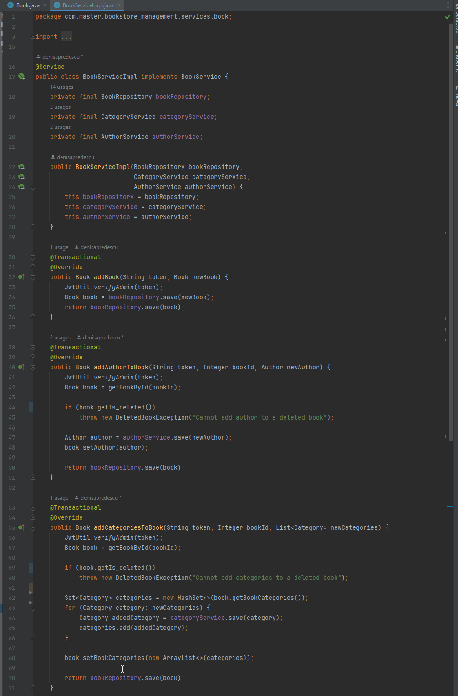
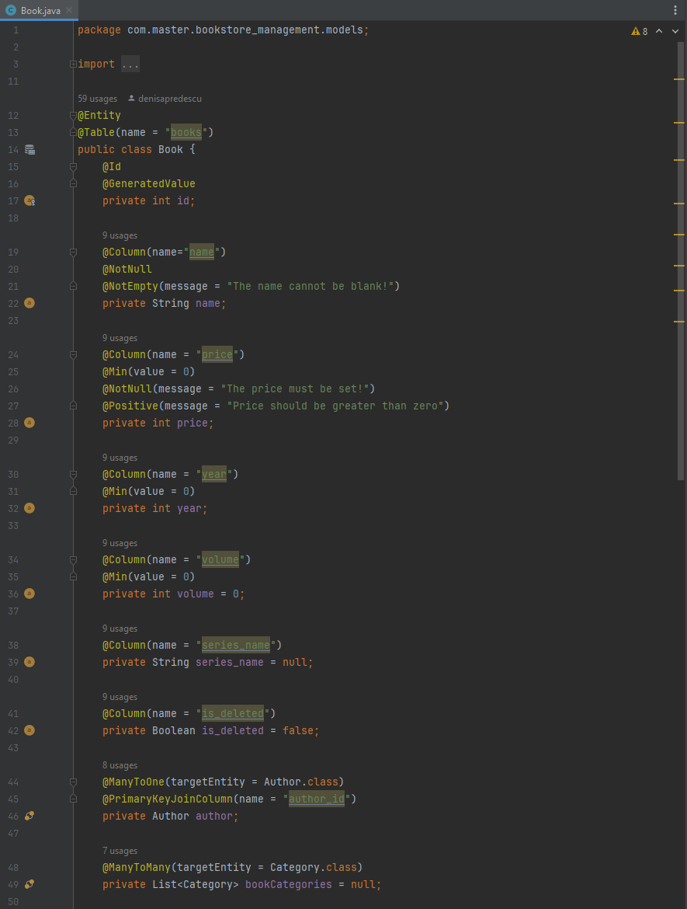

# Bookstore Management

## <i>Business requirements:</i>

1. The admin can add, update and hard delete authors.
2. The user can get all the authors with their details from database.
3. The admin can add, update, hard delete categories.
4. The user can get all the categories.
5. The admin can add, update, soft delete and get all the books.
6. The user can see all the available books.
7. The user can filter books by author or by category.
8. The user can see his basket.
9. The user can add and remove books from his basket.
10. The user can increase and decrease numbers of copies of books from his basket.
11. The user can submit order.
12. The user can make an account, login and soft delete his account.
13. The admin can see a list of all users. 
14. The admin can add and remove the matching between a book and categories/author.

## <i>5 main features:</i>

## REST endpoints for all the features defined for the MVP

<b>Folder with all the controllers</b>

  

<b>Endpoint example to show @RestController annotation, the URL and some CRUD operations</b>

  

<b>Present all the endpoints in swagger</b>

  

## Beans for defining services

<b>Picture of the folder with all the services</b>

  

<b>Example to show @Service annotation and some business logic implementation</b>

  

## Beans for defining repositories. One repository per entity.

<b>Folder with all the entities and repositories</b>

  
   
  

  
<b>Example of beans for defining repositories to show @Repository annotation and the link with JPARepository</b>

  

    
     
    
  

## Unit tests for all REST endpoints and services

## The data within the application should be persisted in a database. Define at least 6 entities that will be persisted in the database database, and at least 4 relations between them.
 

<b>Picture of the folder with all the entities</b>

  

<b>Pictures of the database and the diagram to present the entities and the relations</b>

  

  

## Validate the POJO classes. You can use the existing validation constraints or create your own annotations if you need a custom constraint

<b>Present the @Valid annotation in Book Controller</b>

  

<b>Present the validation constraints in Book Entity</b>

  

## Document the functionalities in the application such that anyone can use it after reading the document. Every API will be documented by Swagger
 
The route to access the swagger: [<i>http://localhost:8000/swagger-ui/index.html#/</i>](http://localhost:8000/swagger-ui/index.html#/)

<b>Picture of the swagger</b>

  

## The functionality of the application will be demonstrated using Postman

## Exceptions

<b>Folder with the exceptions</b>

  

